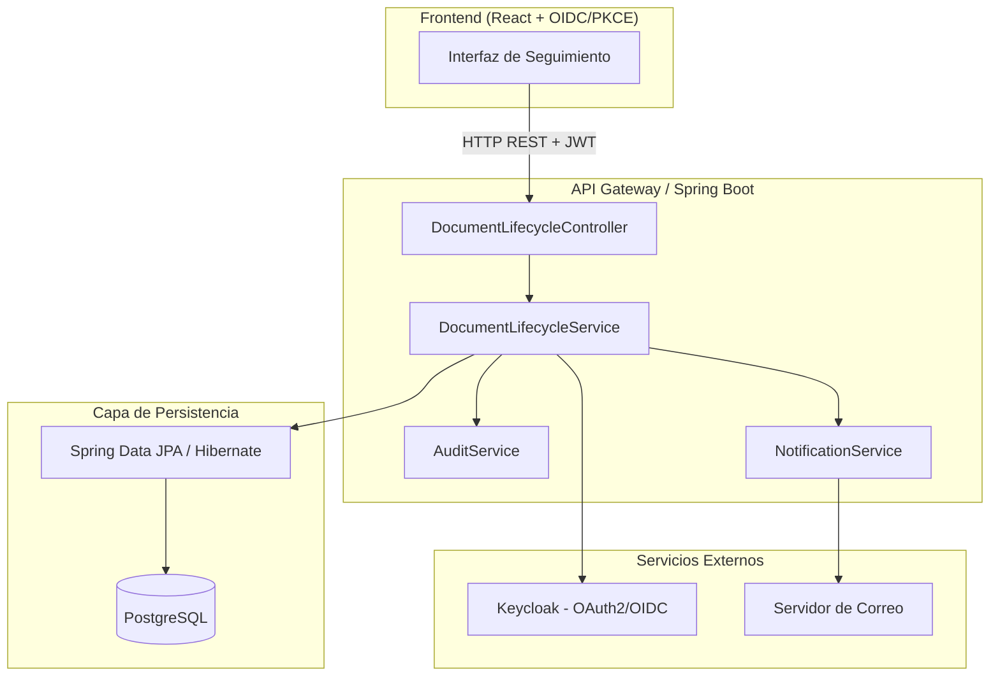
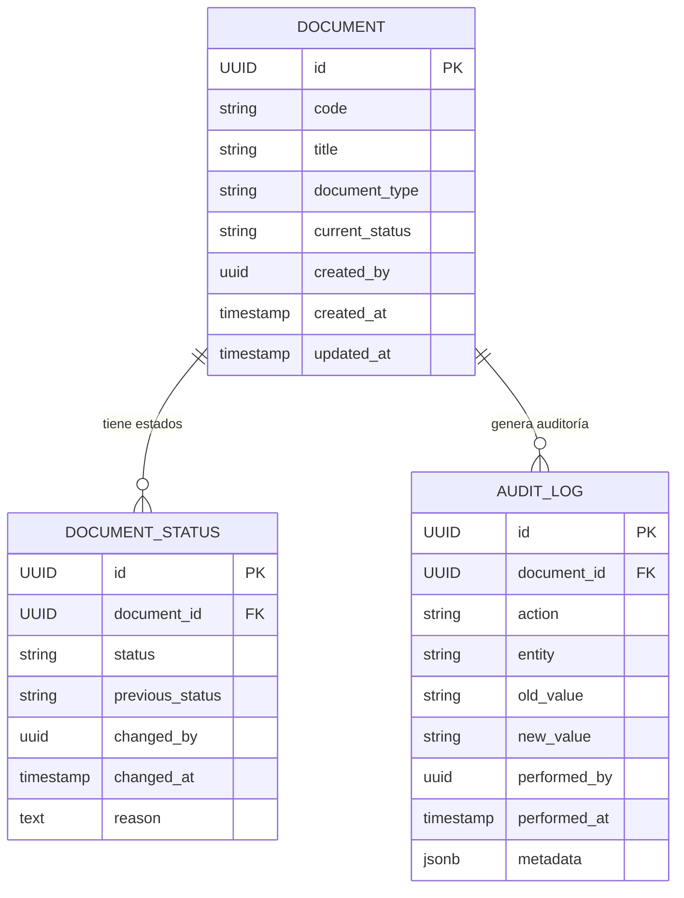
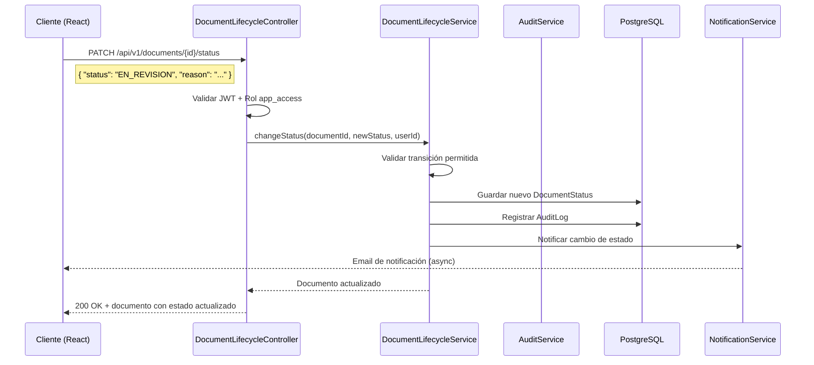
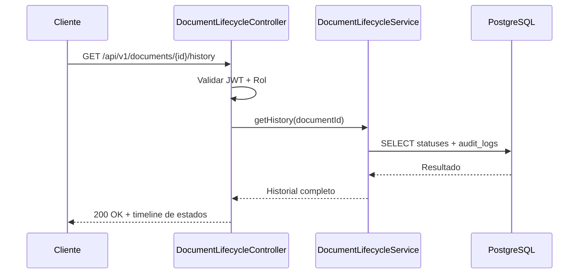

# Arquitectura Técnica — Módulo: Seguimiento del Ciclo de Vida Documental

| Campo              | Valor                                          |
| ------------------ | ---------------------------------------------- |
| **Proyecto**       | api-gestion (Proyecta)                         |
| **Módulo**         | Seguimiento del Ciclo de Vida Documental       |
| **Versión**        | 1.0.0                                          |
| **Fecha**          | 2026-07-29                                     |
| **Autor**          | _[Nombre del autor]_                           |
| **Revisor**        | _[Nombre del revisor]_                         |
| **Estado**         | Borrador / En revisión / Aprobado              |
| **Clasificación**  | Interna                                        |

---

## 1. Objetivo

Describir la arquitectura técnica del módulo **Seguimiento del Ciclo de Vida Documental**, incluyendo componentes, flujo de datos, consideraciones de seguridad y decisiones de diseño relevantes para la trazabilidad completa de documentos según estándares ITIL.

---

## 2. Alcance

| En dentro del alcance                                   | Fuera del alcance                          |
| ------------------------------------------------------- | ------------------------------------------ |
| Gestión de estados del documento (creación → archivo)   | Generación de contenido de documentos      |
| Registro de auditoría y trazabilidad                    | Almacenamiento binario de archivos grandes  |
| Notificaciones de cambios de estado                     | Workflow de aprobación humana              |
| Consulta del historial completo                         | Integración con sistemas externos (futuro)  |

---

## 3. Vista de Componentes

### 3.1 Diagrama de Componentes (Plantilla Mermaid)



### 3.2 Descripción de Componentes

| Componente                         | Responsabilidad                                                   | Tecnología                   |
| ---------------------------------- | ----------------------------------------------------------------- | ---------------------------- |
| `DocumentLifecycleController`      | Expone endpoints REST, validación de entrada, control de errores  | Spring MVC                   |
| `DocumentLifecycleService`         | Lógica de negocio: transiciones de estado, reglas del ciclo       | Spring Boot                  |
| `AuditService`                     | Registra cada cambio de estado con timestamp, usuario y metadatos | Spring Data JPA              |
| `NotificationService`              | Envía notificaciones al cambiar de estado                         | Spring Mail / SMTP           |
| `Spring Data JPA / Hibernate`      | Acceso a datos, mapeo objeto-relacional                           | Hibernate 6.x                |
| `PostgreSQL`                       | Persistencia de estados, historial y metadatos del documento      | PostgreSQL 16+               |
| `Keycloak`                         | Autenticación y autorización (OAuth2 Resource Server)             | Keycloak 24+                 |

---

## 4. Modelo de Dominio

### 4.1 Diagrama de Entidades (ER)



### 4.2 Enumeración de Estados del Ciclo de Vida

```
BORRADOR → EN_REVISION → APROBADO → PUBLICADO → VIGENTE → OBSOLETO → ARCHIVADO
                ↓                                           ↓
            RECHAZADO                                   RETIRADO
```

| Estado         | Descripción                                     | Transiciones válidas                |
| -------------- | ----------------------------------------------- | ----------------------------------- |
| `BORRADOR`     | Documento en creación, editable                 | EN_REVISION, ELIMINADO              |
| `EN_REVISION`  | Sometido a revisión                             | APROBADO, RECHAZADO, BORRADOR       |
| `RECHAZADO`    | Rechazado durante la revisión                   | BORRADOR, ELIMINADO                 |
| `APROBADO`     | Aprobado para publicación                       | PUBLICADO, BORRADOR                 |
| `PUBLICADO`    | Visible para usuarios autorizados               | VIGENTE                             |
| `VIGENTE`      | Documento activo y en uso                       | OBSOLETO, RETIRADO                  |
| `OBSOLETO`     | Fuera de uso pero conservado por trazabilidad   | ARCHIVADO                           |
| `RETIRADO`     | Retirado por decisión administrativa            | ARCHIVADO                           |
| `ARCHIVADO`    | Estado final, solo lectura                      | — (terminal)                        |
| `ELIMINADO`    | Eliminado lógico (soft delete)                  | — (terminal)                        |

---

## 5. Flujo de Datos

### 5.1 Flujo Principal: Transición de Estado



### 5.2 Flujo de Consulta de Historial



---

## 6. Seguridad

### 6.1 Autenticación y Autorización

| Aspecto              | Detalle                                                                 |
| -------------------- | ----------------------------------------------------------------------- |
| **Mecanismo**        | OAuth2 Resource Server (JWT Bearer)                                     |
| **Proveedor**        | Keycloak (`gob-cundinamarca-devqa`)                                     |
| **Issuer**           | `http://172.20.6.59:8080/realms/gob-cundinamarca-devqa`                 |
| **Client ID**        | `proyecta-web`                                                          |
| **Rol requerido**    | `app_access`                                                            |
| **Scope**            | `openid profile email`                                                  |

### 6.2 Control de Acceso por Endpoint

| Endpoint                              | Método   | Rol requerido     | Observación                          |
| -------------------------------------- | -------- | ----------------- | ------------------------------------ |
| `GET /documents/{id}`                 | GET      | `app_access`      | Lectura                              |
| `GET /documents/{id}/history`         | GET      | `app_access`      | Consulta historial                   |
| `PATCH /documents/{id}/status`        | PATCH    | `app_access`      | Transición de estado                 |
| `POST /documents`                     | POST     | `app_access`      | Crear documento                      |
| `DELETE /documents/{id}`              | DELETE   | `app_access`      | Soft delete                          |

### 6.3 Protección de Datos

- **Cifrado en reposo**: PostgreSQL con extensiones de cifrado a nivel de volumen (configuración del DBA).
- **Máscara de datos sensibles**: Campos PII se almacenan cifrados con AES-256 y se enmascaran en respuestas.
- **Rate limiting**: Máximo 100 requests/minuto por usuario para endpoints de escritura.

### 6.4 Auditoría de Seguridad

| Evento                           | Nivel   | Destino            |
| -------------------------------- | ------- | ------------------ |
| Login exitoso                    | INFO    | AuditLog + syslog  |
| Login fallido                    | WARN    | AuditLog + syslog  |
| Transición de estado             | INFO    | AuditLog           |
| Intento de acceso no autorizado  | WARN    | AuditLog + syslog  |
- Todos los eventos incluyen: `userId`, `IP`, `User-Agent`, `timestamp`, `resourceId`.

---

## 7. Decisiones de Diseño (ADRs)

### ADR-001: Soft Delete en lugar de eliminación física

- **Estado**: Aprobado
- **Contexto**: Los documentos deben mantener trazabilidad completa según ITIL.
- **Decisión**: Usar campo `deleted_at` (timestamp nullable) en lugar de `DELETE` físico.
- **Consecuencias**: El historial nunca se pierde; las consultas deben filtrar documentos eliminados lógicamente.

### ADR-002: Auditoría en tabla separada

- **Estado**: Aprobado
- **Contexto**: Se requiere un registro inmutable de todos los cambios de estado.
- **Decisión**: Tabla `AUDIT_LOG` independiente con `metadata JSONB` para datos adicionales.
- **Consejo**: Separar la auditoría de la entidad principal facilita retención de datos y cumplimiento normativo.

### ADR-003: Notificaciones asíncronas

- **Estado**: Aprobado
- **Contexto**: Las notificaciones por email no deben bloquear la respuesta al cliente.
- **Decisión**: Usar `@Async` con `ThreadPoolTaskExecutor` para envío de emails.
- **Consecuencias**: Se necesita manejo de reintentos y dead-letter queue para emails fallidos.

---

## 8. Requisitos No Funcionales

| Requisito            | Meta                                         | Estrategia                         |
| -------------------- | -------------------------------------------- | ---------------------------------- |
| **Disponibilidad**   | 99.5% mensual                               | Health checks, restart automático  |
| **Latencia**         | < 200ms p95 en endpoints de lectura         | Índices PostgreSQL, cache (futuro) |
| **Escalabilidad**    | 500 usuarios concurrentes                   | Connection pooling, horizontal     |
| **Retención datos**  | 10 años mínimo (cumplimiento ITIL)          | Particionado de tablas por año     |
| **Backup**           | Diario + point-in-time recovery             | pg_dump + WAL archiving            |

---

## 9. Infraestructura

### 9.1 Stack Tecnológico

```
┌─────────────────────────────────────────────┐
│  Frontend: React 18 + oidc-client-ts        │
├─────────────────────────────────────────────┤
│  API: Spring Boot 4.0.5 / Java 25           │
├─────────────────────────────────────────────┤
│  Persistencia: PostgreSQL 16 + Hibernate 6  │
├─────────────────────────────────────────────┤
│  Seguridad: Keycloak 24 (OAuth2/OIDC)       │
├─────────────────────────────────────────────┤
│  CI/CD: GitHub Actions                      │
├─────────────────────────────────────────────┤
│  Contenedores: Docker + Docker Compose      │
└─────────────────────────────────────────────┘
```

### 9.2 Variables de Entorno Requeridas

| Variable                              | Descripción                         | Ejemplo                                   |
| ------------------------------------- | ----------------------------------- | ----------------------------------------- |
| `SPRING_DATASOURCE_URL`              | URL de conexión a PostgreSQL        | `jdbc:postgresql://localhost:5432/proyecta` |
| `SPRING_DATASOURCE_USERNAME`         | Usuario de base de datos            | `proyecta_user`                           |
| `SPRING_DATASOURCE_PASSWORD`         | Contraseña de base de datos         | `***`                                     |
| `SPRING_SECURITY_OAUTH2_RESOURCESERVER_JWT_ISSUER_URI` | Issuer de Keycloak | `http://172.20.6.59:8080/realms/gob-cundinamarca-devqa` |
| `GOB_SECURITY_CORS_ALLOWED-ORIGINS`  | Orígenes permitidos CORS            | `http://localhost:5173`                    |

---

## 10. Riesgos y Mitigaciones

| Riesgo                                       | Impacto | Probabilidad | Mitigación                                      |
| -------------------------------------------- | ------- | ------------ | ----------------------------------------------- |
| Pérdida de datos de auditoría                | Alto    | Bajo         | Backup diario + réplica a segunda instancia     |
| Fallo de Keycloak (autenticación masiva)     | Alto    | Medio        | Cache de tokens, retry con backoff exponencial  |
| Degradación del rendimiento por volumen      | Medio   | Medio        | Particionado de tablas, índices optimizados     |
| Incumplimiento de retención documental       | Alto    | Bajo         | Políticas de retención configuradas en DB       |

---

## 11. Glosario

| Término             | Definición                                                              |
| ------------------- | ----------------------------------------------------------------------- |
| **Ciclo de Vida**   | Conjunto de estados por los que transcurre un documento                 |
| **Transición**      | Cambio de un estado a otro dentro del ciclo de vida                     |
| **Auditoría ITIL**  | Registro inmutable de todos los cambios realizados sobre un elemento    |
| **Soft Delete**     | Eliminación lógica mediante marca de tiempo, sin borrado físico         |
| **ADR**             | Architecture Decision Record — registro de decisiones de arquitectura   |

---

## 12. Referencias

- [ITIL 4 Foundation](https://www.axelos.com/certifications/itil-foundation)
- [Keep a Changelog](https://keepachangelog.com/)
- [Spring Boot Reference](https://docs.spring.io/spring-boot/docs/current/reference/htmlsingle/)
- [OAuth 2.0 Resource Server](https://docs.spring.io/spring-boot/docs/current/reference/htmlsingle/#web.security.oauth2.server)

---

## 13. Historial de Revisiones del Documento

| Versión | Fecha       | Autor            | Cambios realizados               |
| ------- | ----------- | ---------------- | -------------------------------- |
| 1.0.0   | 2026-07-29  | _[Autor]_        | Creación inicial del documento   |
